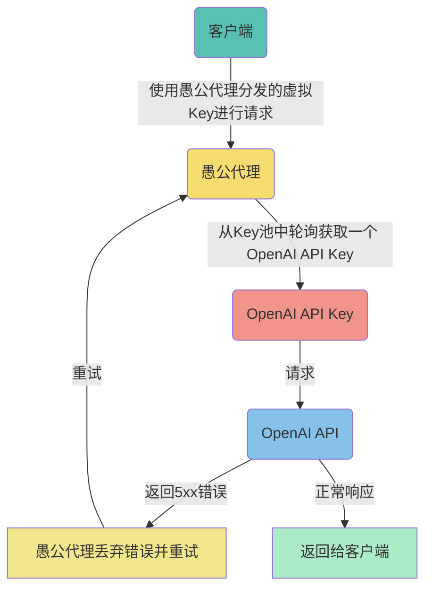

# ProxyXAI

https://proxyxai.com

架构设计为一个可靠、高效且安全的 OpenAI API Keys 管理系统，为用户提供更好的 API 接入服务,一个吃 OpenAI API Keys 的系统,喂入 OpenAI API Keys,输出稳定可靠的 API 接入服务

## 实现原理

## 授权部署

1. API  `docker-compose -f docker-compose.yml up -d` 一键拉起,默认启动端口是 3443
2. 余额查询(静态资源) 可将 pages/billing 目录独立部署在 nginx 即可 
3. 子账号(静态资源) 可将 pages/user 目录独立部署在 nginx 即可

## 部署案例

我们以 https://proxyxai.com 说明部署和域名资源分配结构

- 部署 api.proxyxai.com, nginx 配置一个服务将 api.proxyxai.com 80/443 关联到 api 服务的 3443 端口
- 部署 usage.proxyxai.com, nginx 配置 usage.proxyxai.com 请求关联到 pages/billing 静态文件目录
- 部署 sub.proxyxai.com, nginx 配置 sub.proxyxai.com 请求关联到 pages/user 静态文件目录
- 部署 proxyxai.com, nginx 配置 proxyxai.com 请求关联到 pages/docs 静态文件目录

## 初始设置

1. 录入 OpenAI API Keys,操作请求 `curl -X POST -H "Authorization: $key" -d '{"SecretKey": "sk-xxx"}' https://api.proxyxai.com/x-keys', 录入成功后返回 HTTP 状态码 200
2. 在子账号系统分配子账号,即可下发使用

?> 这里使用 root key 请求管理API;录入的 OpenAI API Keys 如果失效,系统将全自动清理,不再需要人工干预
