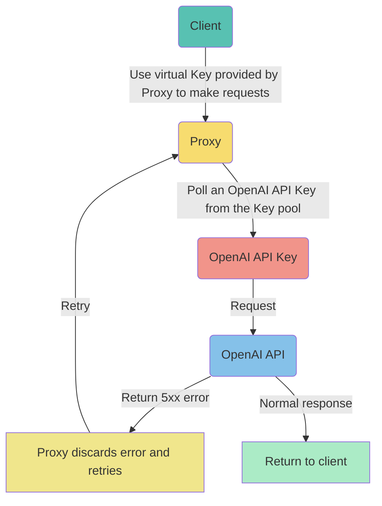
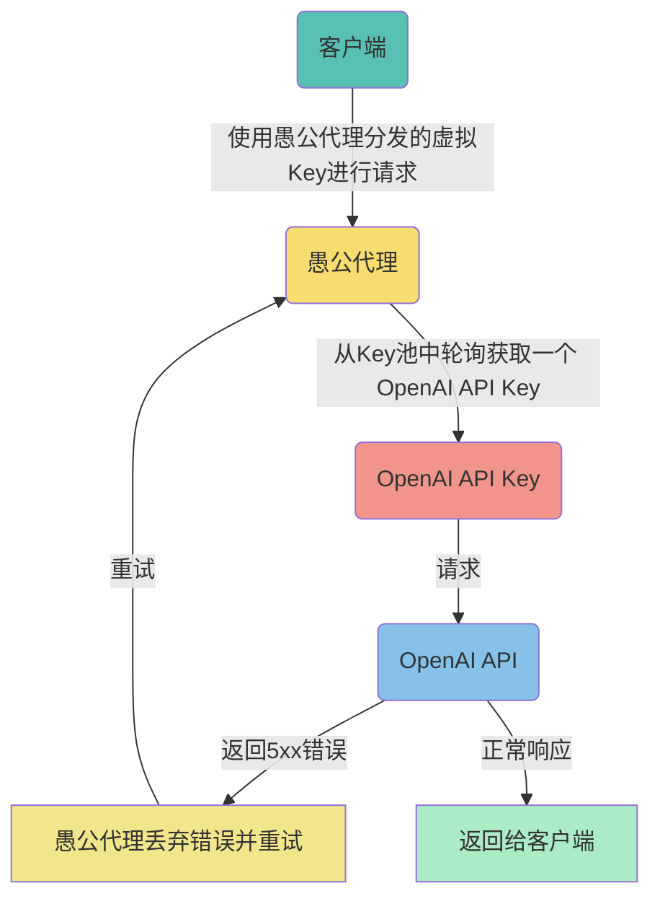

# ProxyXAI-OpenAI

ProxyXAI is designed as a reliable, efficient, and secure OpenAI API Keys management system, providing users with better API access services. It is a system that consumes OpenAI API Keys and outputs stable and reliable API access services.

## Implementation Principle



## License Agreement

The system is open for deployment. Users need to retain the signature `proxyxai.com provides basic support` at the bottom of the official service page, and link to [proxyxai.com](https://proxyxai.com). If you do not want to keep the signature, you need to obtain our authorization.

## Resource Dependencies

Recommended AWS t3.small, t3.micro, or other 2-core 2G overseas hosts, with a minimum configuration requirement of 1-core 1G.

## Environment Installation

Depends on the docker environment and docker-compose container management tool.

```
1. yum -y install docker
2. curl -L https://github.com/docker/compose/releases/latest/download/docker-compose-$(uname -s)-$(uname -m) -o /usr/local/bin/docker-compose
3. chmod +x /usr/local/bin/docker-compose
4. curl -L https://github.com/proxyxai/openai/blob/main/docker-compose.yml -o docker-compose.yml
5. docker-compose -f docker-compose.yml up -d
```

## Deployment Instructions

1. API: Use `docker-compose -f docker-compose.yml up -d` to start the service with one click. The default startup port is 3443.
2. Balance query (static resources): Deploy the pages/billing directory independently in nginx.
3. Sub-account (static resources): Deploy the pages/user directory independently in nginx.

## Deployment Example

We will use [proxyxai.com](https://proxyxai.com) as an example to illustrate the deployment and domain resource allocation structure.

- Deploy api.proxyxai.com, configure an nginx service to associate api.proxyxai.com 80/443 with the API service's 3443 port.
- Deploy usage.proxyxai.com, configure nginx to associate usage.proxyxai.com requests with the pages/billing static file directory.
- Deploy sub.proxyxai.com, configure nginx to associate sub.proxyxai.com requests with the pages/user static file directory.
- Deploy proxyxai.com, configure nginx to associate proxyxai.com requests with the pages/docs static file directory.

## Initial Setup

1. Enter OpenAI API Keys by making a request: `curl -X POST -H "Authorization: $key" -d '{"SecretKey": "sk-xxx"}' https://api.proxyxai.com/x-keys`. After successful entry, the HTTP status code 200 is returned.
2. After entering, restart the system to load the Keys into memory immediately: `docker-compose down;docker-compose -f docker-compose.yml up -d`.
3. Allocate sub-account quotas in the sub-account system, and then issue them to users.

The `$key` here refers to the root key in the deployed docker-compose.yml for managing the API. If the entered OpenAI API Keys become invalid, the system will automatically clean them up without any manual intervention.

For more API management details, please read [proxyxai.com](https://proxyxai.com/#/api)

## Special Note

By default, the docker-compose.yml file sets OPENAI_API_BASE to api.openai.com. Therefore, you need to input the OpenAI API Keys obtained from the official OpenAI platform. If you need to use API Keys from other proxy providers, you should change OPENAI_API_BASE to the corresponding service node address, such as api.xxx.xxx. We call this usage method "multi-level cascading deployment," while the default method of proxying to the official node api.openai.com is called "single-level cascading deployment."

## Special Thanks

[openai.com](https://openai.com)

---

# ProxyXAI-OpenAI (中文)

ProxyXAI 是一个可靠、高效且安全的 OpenAI API Keys 管理系统，为用户提供更好的 API 接入服务。它是一个消耗 OpenAI API Keys 的系统，输出稳定可靠的 API 接入服务。

## 实现原理



## 授权协议

系统开放部署，使用者需要在官方服务页面底部保留署名 `proxyxai.com 提供基础支撑`，同时指向链接 [proxyxai.com](https://proxyxai.com)。如果不想保留署名，需要获得我们的授权。

## 资源依赖

推荐 AWS t3.small, t3.micro 等机型，或者一般 2核2G 配置的海外主机，最低配置要求 1核1G。

## 环境安装

依赖 docker 环境以及 docker-compose 容器管理工具。

```
1. yum -y install docker
2. curl -L https://github.com/docker/compose/releases/latest/download/docker-compose-$(uname -s)-$(uname -m) -o /usr/local/bin/docker-compose
3. chmod +x /usr/local/bin/docker-compose
4. curl -L https://github.com/proxyxai/openai/blob/main/docker-compose.yml -o docker-compose.yml
5. docker-compose -f docker-compose.yml up -d
```

## 部署说明

1. API：使用 `docker-compose -f docker-compose.yml up -d` 一键拉起，默认启动端口是 3443。
2. 余额查询（静态资源）：可将 pages/billing 目录独立部署在 nginx 上。
3. 子账号（静态资源）：可将 pages/user 目录独立部署在 nginx 上。

## 部署案例

我们以 [proxyxai.com](https://proxyxai.com) 为例说明部署和域名资源分配结构。

- 部署 api.proxyxai.com，nginx 配置一个服务将 api.proxyxai.com 80/443 关联到 API 服务的 3443 端口。
- 部署 usage.proxyxai.com，nginx 配置 usage.proxyxai.com 请求关联到 pages/billing 静态文件目录。
- 部署 sub.proxyxai.com，nginx 配置 sub.proxyxai.com 请求关联到 pages/user 静态文件目录。
- 部署 proxyxai.com，nginx 配置 proxyxai.com 请求关联到 pages/docs 静态文件目录。

## 初始设置

1. 录入 OpenAI API Keys，操作请求：`curl -X POST -H "Authorization: $key" -d '{"SecretKey": "sk-xxx"}' https://api.proxyxai.com/x-keys`。录入成功后返回 HTTP 状态码 200。
2. 录入后，因为系统默认每隔2小时自动加载一次 Keys 到内存，如需立即生效，可以重启即刻加载：`docker-compose down;docker-compose -f docker-compose.yml up -d`。
3. 在子账号系统分配子账号额度，即可下发给用户使用。

这里的 `$key` 是指部署的 docker-compose.yml 里的 root key，用于请求管理 API。录入的 OpenAI API Keys 如失效，系统将全自动清理，不再需要人工干预。

更多 API 管理细节，请阅读 [proxyxai.com](https://proxyxai.com/#/api)

## 特别说明

默认情况下，docker-compose.yml 文件里将 OPENAI_API_BASE 设置为 api.openai.com, 因此，您需要输入从官方 OpenAI 平台获取的 OpenAI API Keys,如果您需要使用来自其他代理提供商的 API Key，您应将 OPENAI_API_BASE 更改为相应的服务节点地址，例如 api.xxx.xxx, 我们将这种使用方法称为“多级串联部署”，而默认代理到官方节点 api.openai.com 的方法称为“一级串联部署”。

## 鸣谢

[openai.com](https://openai.com)
